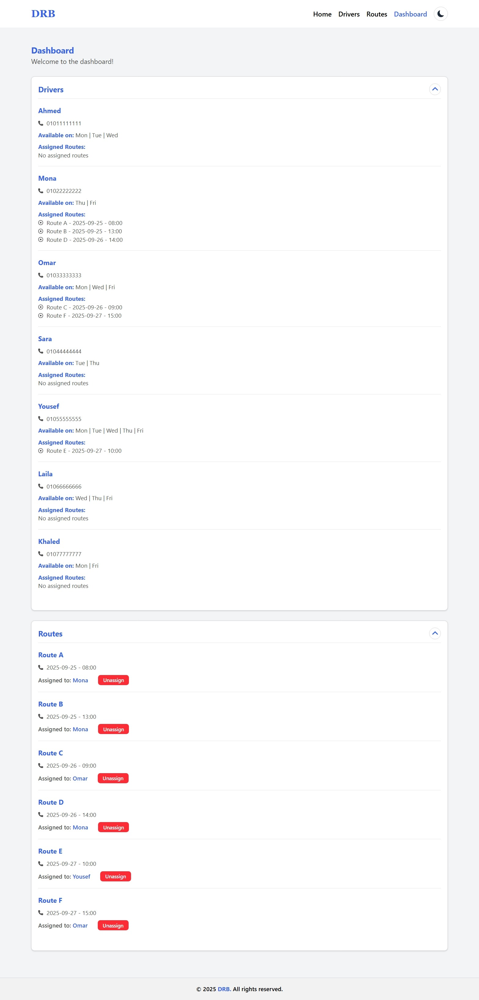

# Driver Scheduling Dashboard

A React frontend application (Vite) for managing drivers, routes and their assignments.

## Live Demo

[View Live Demo - Driver Scheduling Dashboard](https://driver-scheduling-dashboard-delta.vercel.app/)

## Showcase

**Home Page:**


**Add New Driver Page:**


**Add New Route Page:**


**Dashboard Page:**




## Features

- View and manage drivers
- View and manage routes
- Assign routes to drivers
- Dark mode support
- Responsive design for mobile and desktop

## Tech Stack

- **React**
- **Vite**
- **Tailwind CSS**
- **React Router**
- **React Icons**

## Getting Started

1. Clone the repository
   ```bash
   git clone https://github.com/Abdelaziz-Mohammed/driver-scheduling-dashboard.git
   ```
2. Navigate to the project directory
   ```bash
   cd driver-scheduling-dashboard
   ```
3. Install dependencies
   ```bash
   npm install
   ```
4. Start the development server
   ```bash
   npm run dev
   ```
5. Open the app in your browser

```bash
   http://localhost:3000
```

## 👨‍💻 Author

**Eng. Abdelaziz Mohamed**

- [LinkedIn](https://www.linkedin.com/in/abdelaziz)
- [GitHub](https://github.com/Abdelaziz-Mohammed)
